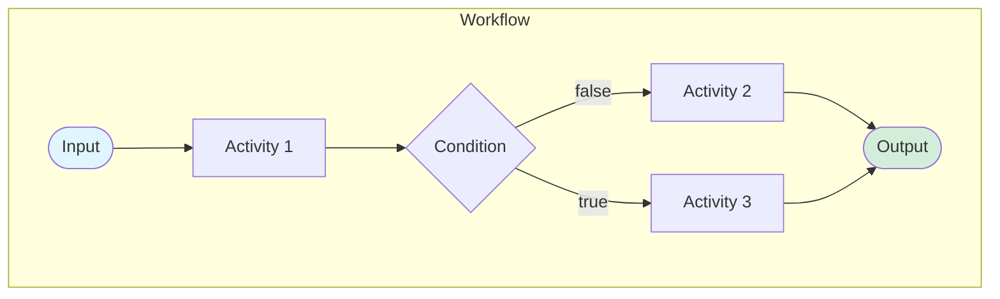

# Dapr Workflow

- Dapr has a built-in workflow engine.
- Workflows are defined in code.
- Workflows are stateful, and (should be) deterministic.
- Activities are the the building blocks of a workflow, they contain non-deterministic code.

