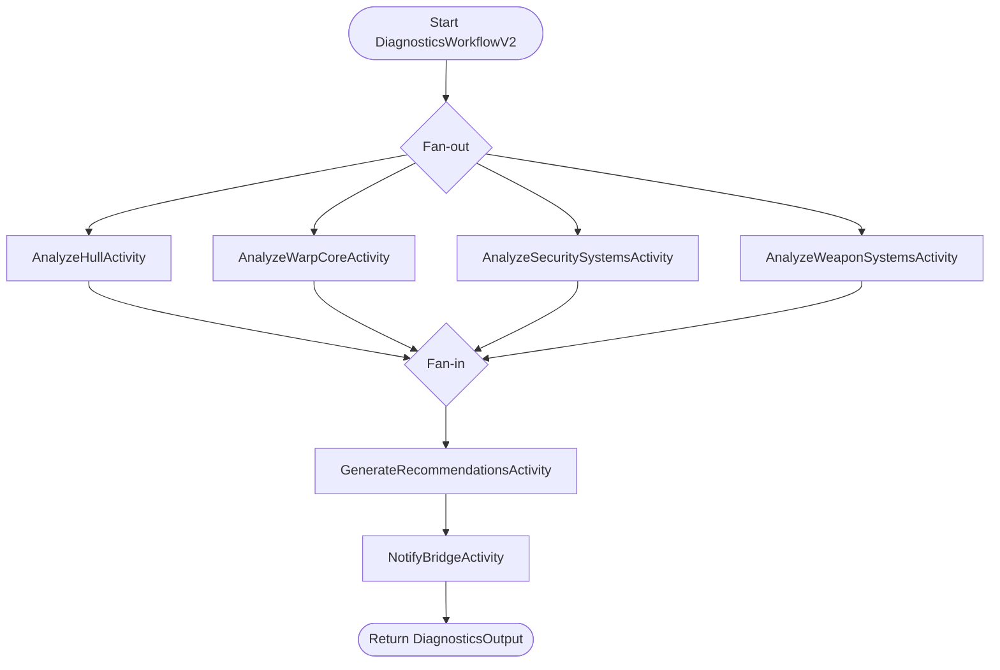

# Diagnostics Workflow V2

```mermaid
flowchart TD
    Start([Start DiagnosticsWorkflowV2]) --> Fan{Fan-out}
    Fan --> Hull[AnalyzeHullActivity]
    Fan --> WarpCore[AnalyzeWarpCoreActivity]
    Fan --> Security[AnalyzeSecuritySystemsActivity]
    Fan --> Weapons[AnalyzeWeaponSystemsActivity]
    Hull --> Join{Fan-in}
    WarpCore --> Join
    Security --> Join
    Weapons --> Join
    Join --> Recommend[GenerateRecommendationsActivity]
    Recommend --> Notify[NotifyBridgeActivity]
    Notify --> End([Return DiagnosticsOutput])
```
