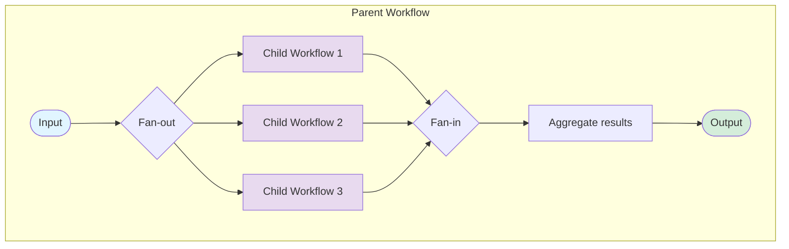

# Pattern: Child Workflows

- A parent workflow orchestrates one or more child workflows.
- Child workflows can run sequentially or in parallel.
- Each child workflow has its own state and execution history.

