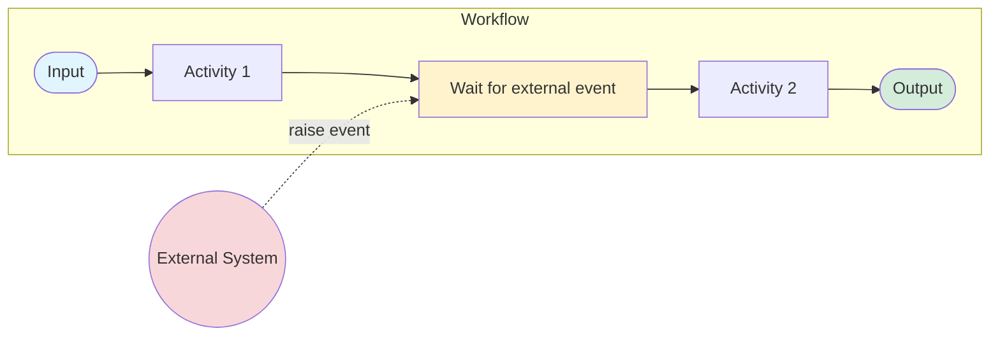

# Pattern: External System Interaction

- The workflow pauses and waits for an external event (e.g. human approval).
- An external system raises the event to resume the workflow.

```mermaid
graph LR
    subgraph Workflow
    direction LR
    Start([Input])
    Start --> A1[Activity 1]
    A1 --> Wait[Wait for external event]
    Wait --> A2[Activity 2]
    A2 --> End([Output])
    end

    External((External System)) -.->|raise event| Wait

    style Start fill:#e1f5ff
    style End fill:#d4edda
    style Wait fill:#fff3cd
    style External fill:#f8d7da
```
