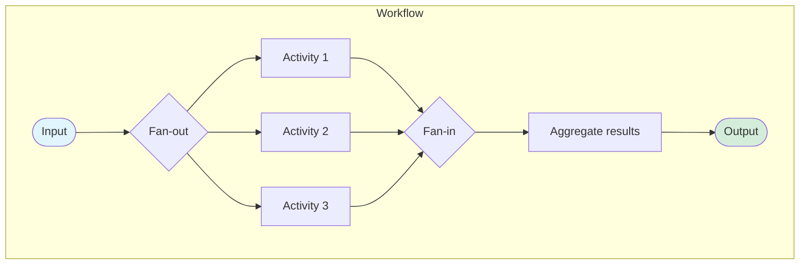

# Pattern: Fan-out / Fan-in

- Multiple activities are executed in parallel (fan-out).
- The workflow waits for all parallel activities to complete (fan-in).

```mermaid
graph LR
    subgraph Workflow
    direction LR
    Start([Input])
    Start --> FO{Fan-out}
    FO --> A1[Activity 1]
    FO --> A2[Activity 2]
    FO --> A3[Activity 3]
    A1 --> FI{Fan-in}
    A2 --> FI
    A3 --> FI
    FI --> Join[Aggregate results]
    Join --> End([Output])
    end

    style Start fill:#e1f5ff
    style End fill:#d4edda
```
