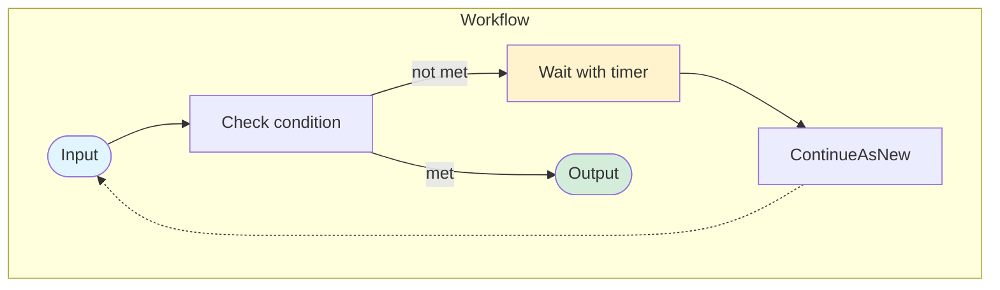

# Pattern: Monitor

- The workflow periodically checks a condition.
- A timer is used to wait between checks.
- The loop exits when the condition is met or a timeout is reached.

```mermaid
graph LR
    subgraph Workflow
    direction LR
    Start([Input])
    Start --> Check[Check condition]
    Check -->|not met| Timer[Wait with timer]
    Timer --> CAN[ContinueAsNew]
    CAN -.-> Start
    Check -->|met| End([Output])
    end

    style Start fill:#e1f5ff
    style End fill:#d4edda
    style Timer fill:#fff3cd
```
