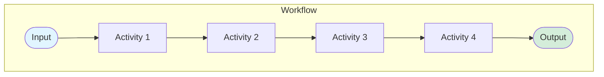

# Pattern: Task Chaining

- Activities are executed sequentially.
- The output of one activity is the input for the next.

```mermaid
graph LR
    subgraph Workflow
    direction LR
    Start([Input])
    A1[Activity 1] --> A2[Activity 2] --> A3[Activity 3] --> A4[Activity 4]
    Start --> A1
    A4 --> End([Output])
    end

    style Start fill:#e1f5ff
    style End fill:#d4edda
```
