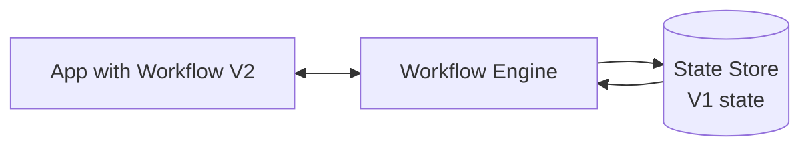

# Dealing with breaking changes in workflows

## Initial workflow

## After deploying V2

V1 workflows were not completed during deployment, they were 'in-flight'.
The workflow engine will try to complete the workflows but the V1 workflow state is incompatible with the V2 workflow.

