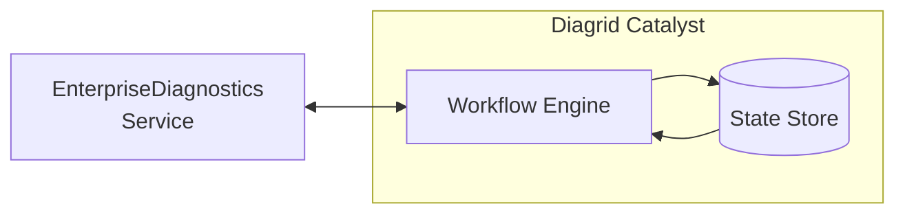

# Local setup with Catalyst

- Docker Desktop
- .NET 10
- Aspire CLI
- Diagrid CLI (connect with Catalyst)

_No need for Dapr CLI & Dapr services or a state store for workflow data._

```mermaid
graph LR
    Service[EnterpriseDiagnostics
    Service]
    subgraph Diagrid Catalyst
        Sidecar[Workflow Engine]
        Store[(State Store)]
    end
    Service <--> Sidecar
    Sidecar --> Store
    Store --> Sidecar
```

