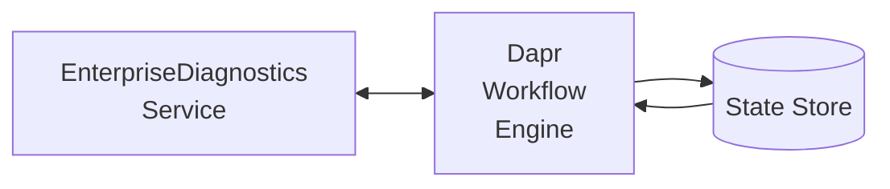

# Local Setup

- Docker Desktop
- Dapr CLI & Dapr services
- Valkey (Redis compatible) state store
- .NET 10
- Aspire CLI
- Diagrid Dev Dashboard (for monitoring/debugging)

```mermaid
graph LR
    Service[EnterpriseDiagnostics
    Service]
    Sidecar[Dapr
    Workflow
    Engine]
    Store[(State Store)]

    Service <--> Sidecar
    Sidecar --> Store
    Store --> Sidecar
```
