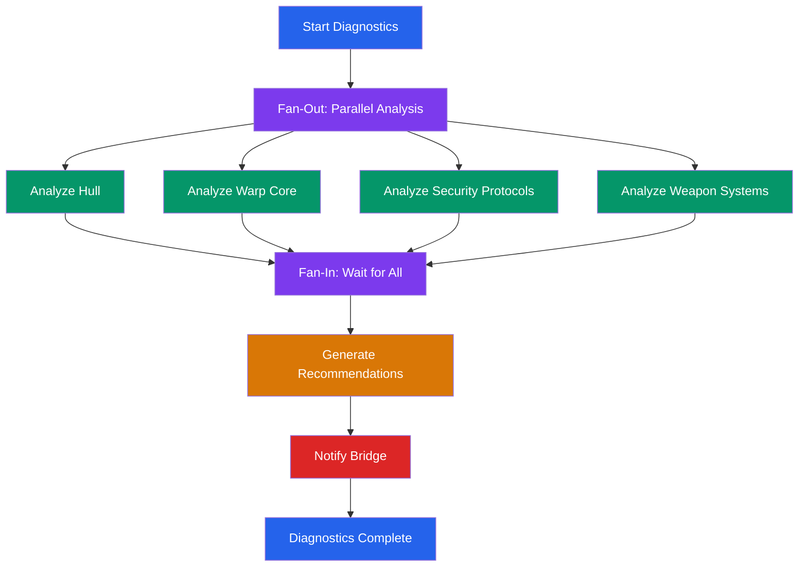

# Enterprise Diagnostics - Dapr Workflow with .NET Aspire

A Dapr Workflow application that performs a comprehensive diagnostics scan for the starship USS Enterprise. The workflow uses the fan-out/fan-in pattern to run four parallel system analyses (hull, warp core, security protocols, and weapon systems), generates prioritized recommendations from the combined results, and sends a bridge notification with the final report. Each activity uses the Dapr Conversation API with an Anthropic LLM to generate diagnostic data.

## Architecture

### Technology Stack

- **.NET Aspire** - Orchestrates all resources (Valkey, Dapr sidecars, Diagrid Dashboard)
- **Dapr Workflow** - Durable workflow execution with fan-out/fan-in pattern
- **Dapr Conversation API** - LLM integration via the Anthropic conversation component
- **Valkey** - State store for workflow persistence (managed by Aspire as a container)
- **Diagrid Dev Dashboard** - Visual workflow inspection tool (managed by Aspire as a container)
- **ServiceDefaults** - Shared Aspire configuration for OpenTelemetry, health checks, and resilience

### Prerequisites

- [.NET 10 SDK](https://dotnet.microsoft.com/en-us/download)
- [Aspire CLI](https://aspire.dev/get-started/install-cli/)
- [Docker](https://www.docker.com/products/docker-desktop/) or [Podman](https://podman.io/docs/installation)
- [Dapr CLI](https://docs.dapr.io/getting-started/install-dapr-cli/) (version 1.17+)
- An [Anthropic API key](https://console.anthropic.com/) - set in `EnterpriseDiagnostics.AppHost/Resources/conversation.yaml`

## Workflow Diagram



## Running the Application

1. Set your Anthropic API key in `EnterpriseDiagnostics.AppHost/Resources/conversation.yaml`:
   ```yaml
   - name: key
     value: "<your-anthropic-api-key>"
   ```

2. Start the application from the solution root:
   ```shell
   aspire run
   ```

   This launches the Aspire AppHost, which orchestrates:
   - A Valkey container for workflow state persistence (port 16379)
   - The ApiService with a Dapr sidecar
   - The Diagrid Dev Dashboard container

   The Aspire dashboard opens automatically in the browser, showing all resources and their status.

## API Endpoints

| Method | Endpoint | Description |
|--------|----------|-------------|
| POST | `/start` | Start a new diagnostics workflow |
| GET | `/status/{instanceId}` | Get workflow status and output |
| POST | `/pause/{instanceId}` | Pause a running workflow |
| POST | `/resume/{instanceId}` | Resume a paused workflow |
| POST | `/terminate/{instanceId}` | Terminate a workflow |

### Examples

**Start a diagnostics workflow:**
```shell
curl -X POST http://localhost:5467/start \
  -H "Content-Type: application/json" \
  -d '{
    "id": "diag-001",
    "shipName": "USS Enterprise NCC-1701-D",
    "diagnosticsDate": "2370-04-08",
    "engineerName": "Geordi La Forge"
  }'
```

**Check workflow status:**
```shell
curl http://localhost:5467/status/diag-001
```

**Pause a workflow:**
```shell
curl -X POST http://localhost:5467/pause/diag-001
```

**Resume a workflow:**
```shell
curl -X POST http://localhost:5467/resume/diag-001
```

**Terminate a workflow:**
```shell
curl -X POST http://localhost:5467/terminate/diag-001
```

You can also use the HTTP file at [`EnterpriseDiagnostics.ApiService/EnterpriseDiagnostics.ApiService.http`](EnterpriseDiagnostics.ApiService/EnterpriseDiagnostics.ApiService.http) with the VS Code REST Client extension or JetBrains HTTP Client.

## Inspecting Workflow Execution

The Diagrid Dev Dashboard is managed by Aspire and runs as a container resource. To access it:

1. Open the Aspire dashboard (opens automatically when running `aspire run`)
2. Find the `diagrid-dashboard` resource in the resource list
3. Click the endpoint link to open the Diagrid Dev Dashboard
4. Browse workflow instances, view their status, and inspect execution history
