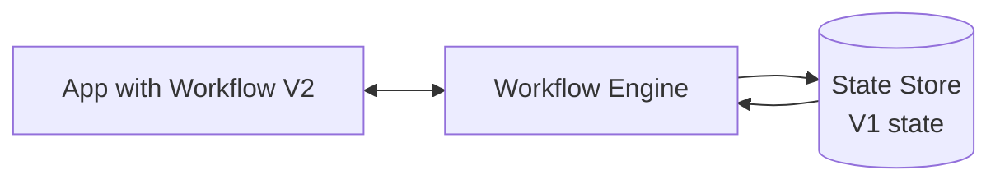
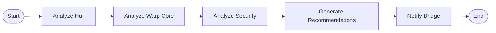
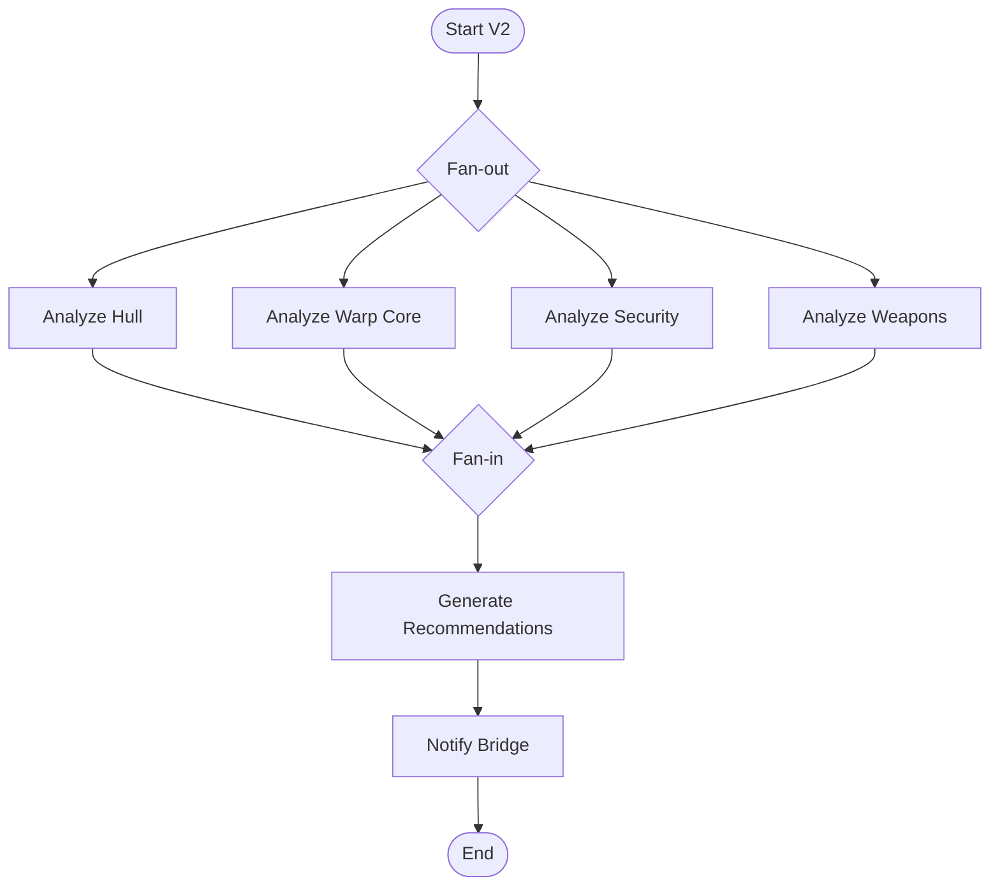
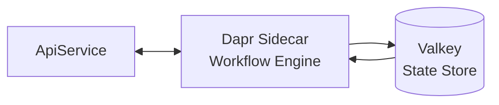
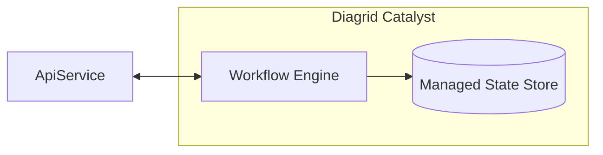

# Dapr Workflow Versioning

> *Your in-flight workflows called and they do not want breaking changes.*

This repository contains the demo code for a talk on **Dapr Workflow versioning**. It shows what goes wrong when you deploy a breaking workflow change while older workflow instances are still running ("in-flight"), and how to evolve a workflow safely using Dapr's two versioning techniques:

- **`IsPatched`** — for small, additive changes within an existing workflow.
- **Named versioning** — for large, breaking changes via a new workflow type (e.g. `DiagnosticsWorkflowV2`).

## The Problem

When V2 of a workflow is deployed, V1 instances may still be running. The workflow engine will try to resume them against state that was written by V1 — but the V2 code expects different state, and replays will fail.



The fix is to keep V1's behavior reachable for in-flight instances while running V2 for new ones.

## The Demo Scenario

A diagnostics workflow for the starship **USS Enterprise**. It analyzes ship subsystems, generates recommendations, and notifies the bridge. The workflow is deliberately evolved across three versions to exercise both versioning techniques.

### V0 — Initial workflow (sequential)



### V1 — Patched (`IsPatched`)

A weapon-systems analysis is added. Existing in-flight instances skip the new branch via `context.IsPatched("AddWeaponsAnalysis")`; new instances run the full path.

### V2 — Named version (fan-out / fan-in)

A new workflow type, `DiagnosticsWorkflowV2`, runs all four analyses in parallel. V1 stays registered so in-flight V1 instances keep completing.



### V3 — Adds retry policies

`DiagnosticsWorkflowV3` adds a `WorkflowRetryPolicy` (5 attempts, 3s initial, 1.5x backoff) to every activity call.

## Architecture

Two solutions ship side by side, demonstrating the same workflow against different runtimes.

### `EnterpriseDiagnostics` — local Dapr via .NET Aspire



- .NET 10 + Aspire CLI orchestrates the ApiService, Dapr sidecar, Valkey state store, and the Diagrid Dev Dashboard
- Conversation API (Anthropic) component is available; activities use mocked outputs by default

### `EnterpriseDiagnostics2` — Diagrid Catalyst



Same workflow, no local Dapr or state store — Catalyst provides the workflow engine and storage as a managed service.

## Getting Started

Prerequisites:

- [.NET 10 SDK](https://dotnet.microsoft.com/en-us/download)
- [Aspire CLI](https://aspire.dev/get-started/install-cli/)
- [Docker Desktop](https://www.docker.com/products/docker-desktop/)
- [Dapr CLI](https://docs.dapr.io/getting-started/install-dapr-cli/) 1.17+ (for the local Dapr solution)
- [Diagrid CLI](https://docs.diagrid.io/) (for the Catalyst solution)

Run the local Dapr version:

```shell
cd EnterpriseDiagnostics
aspire run
```

Trigger workflows via the `.http` file in `EnterpriseDiagnostics.ApiService` or:

```shell
curl -X POST http://localhost:5467/start \
  -H "Content-Type: application/json" \
  -d '{"id":"diag-001","shipName":"USS Enterprise NCC-1701-D","diagnosticsDate":"2370-04-08","engineerName":"Geordi La Forge"}'
```

Each solution's own README has the full API surface and run details.

## Tips

- Always version your workflows once you have a system running in production.
- Use `IsPatched` for small, additive changes.
- Use named versioning for large or breaking changes.

More: [Dapr workflow versioning docs](https://docs.dapr.io/developing-applications/building-blocks/workflow/workflow-versioning/)

## Resources

- [Diagrid Dev Dashboard](https://docs.diagrid.io/develop/diagrid-dashboard/)
- [Dapr University](https://www.diagrid.io/dapr-university)
- [Diagrid Catalyst](https://www.diagrid.io/catalyst)
